# raspberry-FLIR-camera-project

### 개요
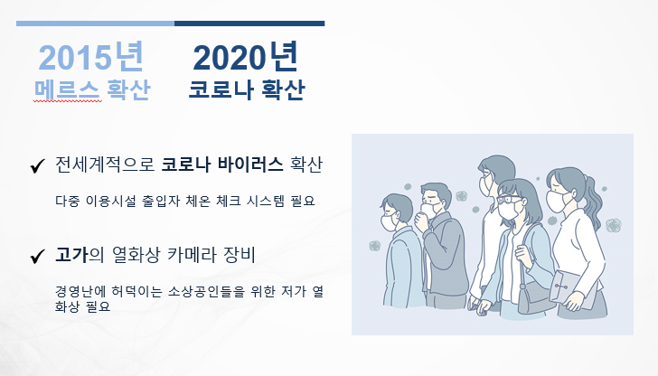

### 현 시스템의 한계 / 문제점
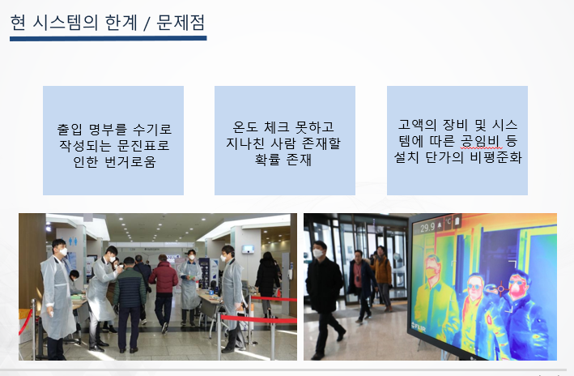

### 기술개발 목표
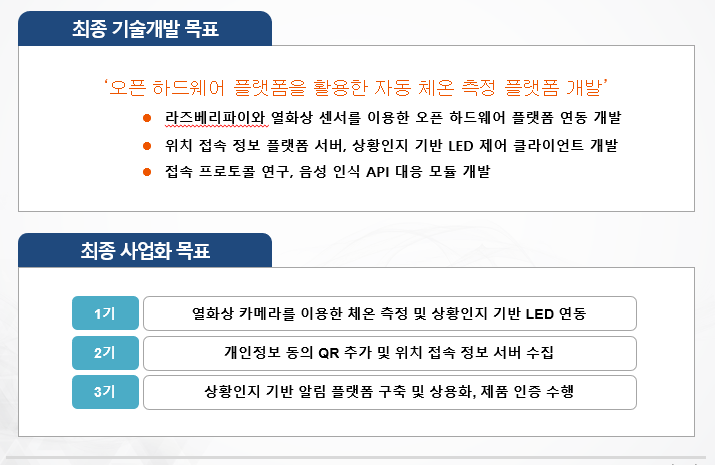

### 개발내용 - 전체 시스템 구성
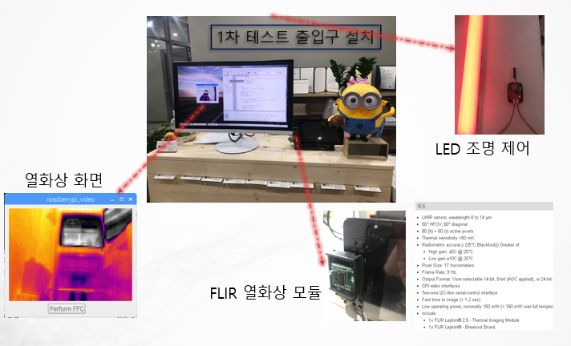

### 개발내용
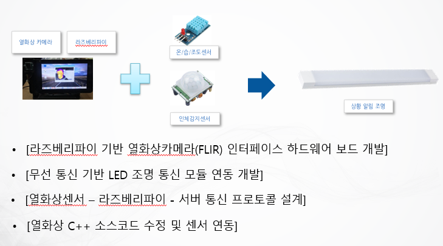

### 개발방법1
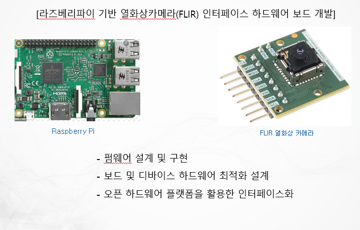

### 개발방법2
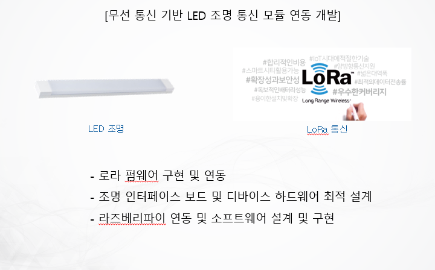

### 개발방법3
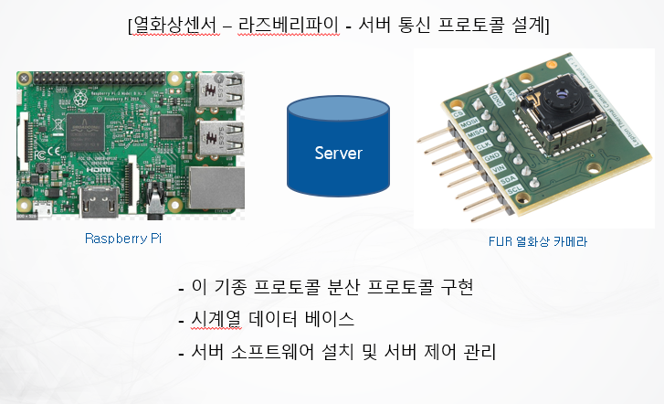

### 참여자의 활동내용(표)
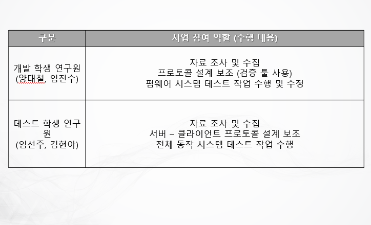

### 경쟁사 제품과의 차별성
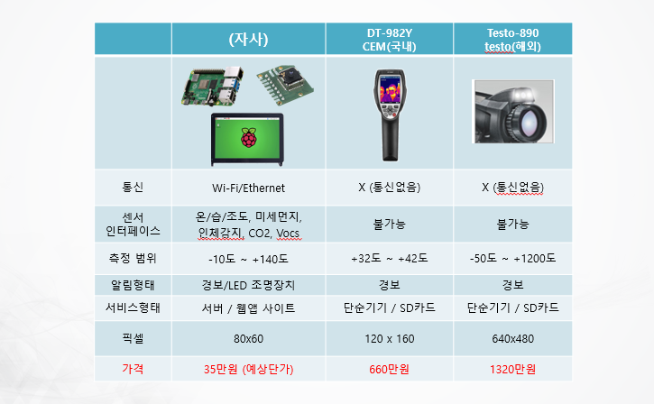

### 결과물의 기대 효과

### 결과물의 활용
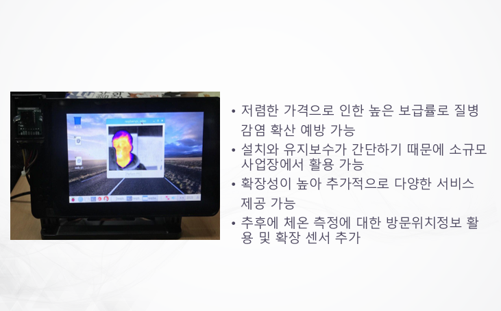
